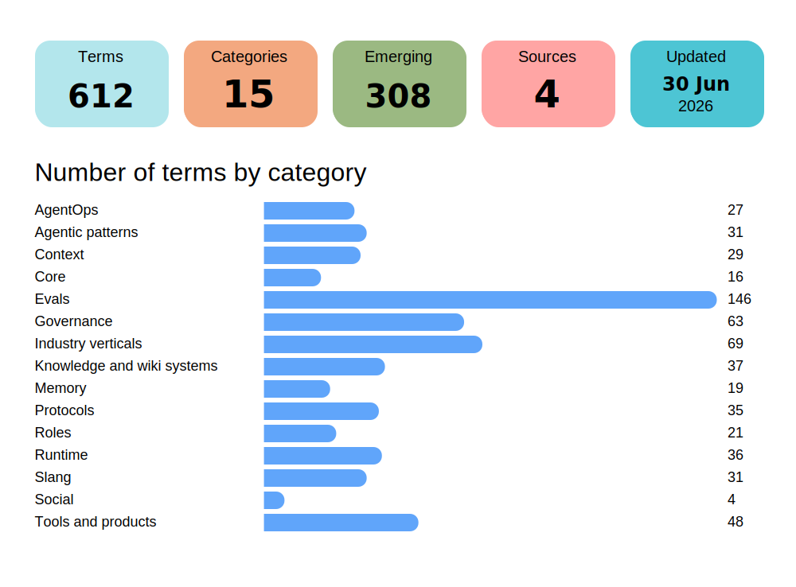

# Agentic AI Buzzword Dictionary

A living dictionary of agentic AI terminology, runtime language, governance terms, protocol vocabulary, and meme slang.

## AgentOps

- [Agent Debt](terms/items/agent-debt.md): Agent debt is the build-up of weak spots in an AI agent system that make it harder, riskier, or more expensive to change and run safely.
- [Agent Estate](terms/items/agent-estate.md): The full live set of AI agents an organisation runs, plus the people,
- [Agent Evals](terms/items/agent-evals.md): Tests that check whether an AI agent can complete real tasks correctly
- [Agent Inventory](terms/items/agent-inventory.md): A live record of the AI agents an organisation uses, who owns them,
- [Agent Lifecycle Management](terms/items/agent-lifecycle-management.md): Managing an AI agent from approval and launch through updates,
- [Agent Ownership Model](terms/items/agent-ownership-model.md): A clear way to decide which people are responsible for an AI agent
- [Agent Portfolio](terms/items/agent-portfolio.md): A group of AI agents that are owned, compared, and managed together.
- [Agent Sprawl](terms/items/agent-sprawl.md): Agent sprawl is when AI agents spread faster than an organisation
- [AgentOps](terms/items/agentops.md): AgentOps is the work of running AI agents safely in real use, with
- [Agentic Evaluation](terms/items/agentic-evaluation.md): Testing an AI agent by looking at its steps, tool use, and decisions,
- [Autonomous Workflow](terms/items/autonomous-workflow.md): A workflow that can keep moving and recover from common problems
- [Continuous Validation](terms/items/continuous-validation.md): Ongoing checks that an AI system still behaves as expected after launch.
- [Cost per Workflow](terms/items/cost-per-workflow.md): The average total cost of completing one workflow from start to
- [Evidence-Grade Audit Trail](terms/items/evidence-grade-audit-trail.md): A detailed record of actions and events that is good enough to
- [Exception Rate](terms/items/exception-rate.md): The share of workflows that need manual handling, escalation, or
- [Execution Quality](terms/items/execution-quality.md): How well an agent finishes a task in a real run.
- [Ghost Agent](terms/items/ghost-agent.md): A ghost agent is an agent that still appears in records, but is
- [Harness Engineering](terms/items/harness-engineering.md): The work of building the control layer around an AI agent so it can
- [Multi-Agent Governance](terms/items/multi-agent-governance.md): The rules, checks, and ownership that keep several AI agents working
- [Orphan Agent](terms/items/orphan-agent.md): An orphan agent is an agent with no clear owner for its behaviour,
- [Outcome Reliability](terms/items/outcome-reliability.md): How often an agent reaches the result it was meant to achieve.
- [Pilot Purgatory](terms/items/pilot-purgatory.md): A project gets stuck after a promising pilot and never becomes
- [Proof-of-Concept Graveyard](terms/items/proof-of-concept-graveyard.md): A proof-of-concept graveyard is a pile-up of demos or pilots that
- [Recovery Readiness](terms/items/recovery-readiness.md): Recovery Readiness is a measure of how well an agent system can
- [Shadow Agent](terms/items/shadow-agent.md): An agent that runs without the normal visibility, approval, or
- [Trajectory Evaluation](terms/items/trajectory-evaluation.md): Checking the steps an agent took, not just the final answer.
- [Verified Outcome](terms/items/verified-outcome.md): A result that has been checked against a clear rule, test, or piece

## Agentic patterns

- [Agent orchestration](terms/items/agent-orchestration.md): Coordination logic that decides which agent runs, in what order, and what happens next.
- [Agent orchestration pipeline](terms/items/agent-orchestration-pipeline.md): A step-by-step control flow that routes work between agents, tools, and checks.
- [Agentic RAG](terms/items/agentic-rag.md): A still-evolving term for RAG systems that can choose, repeat, or adjust retrieval steps while answering.
- [Agentic scaffolding](terms/items/agentic-scaffolding.md): The surrounding software layer that makes an AI agent usable in practice.
- [Augmented LLM](terms/items/augmented-llm.md): A broad term for an LLM that has extra context, retrieval, tools, or memory added around it.
- [Concurrent orchestration](terms/items/concurrent-orchestration.md): A way to run several independent agent tasks at the same time and then combine the results.
- [Control plane for coding agents](terms/items/control-plane-for-coding-agents.md): A control plane for coding agents is the part of a system that
- [Execution isolation](terms/items/execution-isolation.md): Keeping an agent's work inside a limited environment so it cannot freely touch the rest of the system.
- [Fan-in](terms/items/fan-in.md): A step where several parallel tasks send their results back to one place to be combined.
- [Fan-out](terms/items/fan-out.md): A step where one job is split into several smaller tasks that can run in parallel.
- [Flexible memory system](terms/items/flexible-memory-system.md): A flexible memory system is an agent memory design that can store, update, and recall information in different ways depending on the task.
- [Group chat orchestration](terms/items/group-chat-orchestration.md): Multi-agent coordination where agents share one conversation thread and an orchestrator controls who speaks next.
- [Handoff orchestration](terms/items/handoff-orchestration.md): A handoff orchestration pattern lets one agent transfer control to a more suitable agent, and the new agent takes over the task.
- [Human-in-the-loop](terms/items/human-in-the-loop.md): A system design where a person checks, guides, or approves part of the work instead of letting software act alone.
- [Human-on-the-loop](terms/items/human-on-the-loop.md): A setup where a person watches an AI system, can step in if needed, and can stop or change its actions.
- [Maker-checker loop](terms/items/maker-checker-loop.md): A maker-checker loop is a review cycle where one agent or person makes a draft and another checks it, then the draft is revised until it passes or the loop stops.
- [Modular architecture](terms/items/modular-architecture.md): A way of building software as separate parts with clear boundaries and interfaces.
- [Multi-agent collaboration](terms/items/multi-agent-collaboration.md): Two or more AI agents working together on the same task by splitting work, sharing results, or handing off parts of the job.
- [Multi-agent orchestration](terms/items/multi-agent-orchestration.md): Coordination logic that manages how several AI agents share work.
- [Multi-agent research](terms/items/multi-agent-research.md): A research workflow where one lead agent splits a question across several specialist agents and then combines their findings.
- [Persistent sessions](terms/items/persistent-sessions.md): A persistent session is an agent session whose state is saved so work can be resumed later instead of starting over.
- [Plan-and-execute](terms/items/plan-and-execute.md): A way of splitting an agent task into a plan first, then doing the steps one by one.
- [Reflection](terms/items/reflection.md): A reflection step is when an agent looks back at what it just did, spots mistakes, and adjusts the next step.
- [Replanning](terms/items/replanning.md): Updating a plan after new information shows the old one is no longer the best path.
- [Role-based agent design](terms/items/role-based-agent-design.md): A way of building an agent system by giving different agents different jobs, such as researcher, checker, planner, or writer.
- [Rollback](terms/items/rollback.md): Returning a system to an earlier version or state after a change causes problems.
- [Safe delegation](terms/items/safe-delegation.md): Delegating a task to an AI agent with clear limits, checks, and a way to stop or review what it does.
- [Sequential orchestration](terms/items/sequential-orchestration.md): A pattern where agent steps run one after another, and each step uses the output of the step before it.
- [Server-side compaction](terms/items/server-side-compaction.md): A server-managed way to shorten conversation state so an agent can keep going when its context gets too large.
- [Tamper-evident audit trail](terms/items/tamper-evident-audit-trail.md): A record of actions that makes later editing, deletion, or forgery visible.
- [Tool routing](terms/items/tool-routing.md): The step that chooses which tool an agent should use for a request.

## Context

- [Agentic Hub](terms/items/agentic-hub.md): A central layer that helps an AI agent find and use tools, data,
- [Causal Attribution](terms/items/causal-attribution.md): Working out which earlier step, source, or action really caused
- [Context Collapse](terms/items/context-collapse.md): A loose term for when an AI system’s useful context gets flattened,
- [Context Constructor](terms/items/context-constructor.md): A context constructor is the part of an AI system that chooses
- [Context Debt](terms/items/context-debt.md): The build-up of stale, duplicated, missing, or poorly delivered
- [Context Drift](terms/items/context-drift.md): A gradual change in the information an AI system uses, which can
- [Context Engineering](terms/items/context-engineering.md): The deliberate work of choosing, shaping, and updating the information
- [Context Fabric](terms/items/context-fabric.md): A context fabric is a shared layer that helps different AI agents
- [Context Federation](terms/items/context-federation.md): Context Federation is a loose term for coordinating context across
- [Context Fragmentation](terms/items/context-fragmentation.md): Context fragmentation is when the information an AI agent needs
- [Context Freshness](terms/items/context-freshness.md): How recent and relevant the information in an agent's working context
- [Context Graph](terms/items/context-graph.md): A context graph is a graph-shaped way to organise context so an
- [Context Mesh](terms/items/context-mesh.md): A context mesh is a way of moving the right information to the
- [Context Operating System](terms/items/context-operating-system.md): A loose term for the layer that chooses, cleans, and delivers the
- [Context Poisoning](terms/items/context-poisoning.md): Context poisoning is when untrusted text is put into an AI agent's
- [Context Rot](terms/items/context-rot.md): A term for when an AI system becomes less reliable as its context gets longer, noisier, or more out of date.
- [Context Saturation](terms/items/context-saturation.md): Context saturation is the point where adding more material to a model's working context stops helping and can start reducing answer quality.
- [Context Supply Chain](terms/items/context-supply-chain.md): The chain of people, systems, and steps that decide what information
- [Context Topology](terms/items/context-topology.md): A way of describing where an AI system gets its context, how that
- [Data Fabric](terms/items/data-fabric.md): A data fabric is a layer that helps people find, connect, govern,
- [Explicit Provenance](terms/items/explicit-provenance.md): Provenance that is recorded in a visible, machine-readable way so an agent can trace where information came from and how it moved through a system.
- [Governed Context](terms/items/governed-context.md): Governed context means the information given to an AI agent is chosen,
- [Identity-Resolved Data](terms/items/identity-resolved-data.md): Data that has been matched to a real person, service, or role instead
- [Provenance Tensor](terms/items/provenance-tensor.md): A proposed way to describe where agent context came from, how trustworthy
- [RAG](terms/items/rag.md): RAG means a language model looks up relevant information before
- [Safe Evolution](terms/items/safe-evolution.md): A term for changing an agent system in a controlled way so new
- [Shared Context Layer](terms/items/shared-context-layer.md): A shared layer that gives multiple agents the same trusted context,
- [Shared Meanings](terms/items/shared-meanings.md): Shared meanings are the shared understanding that lets people and
- [Verification Cost](terms/items/verification-cost.md): The work needed to check whether an AI answer or action is good

## Core

- [AI Agents](terms/items/ai-agents.md): Software that can work towards a goal by choosing next steps, using
- [Agentic AI](terms/items/agentic-ai.md): A broad and still debated term for AI systems that can plan steps,
- [Agentic Browser](terms/items/agentic-browser.md): A browser that lets an AI inspect web pages and carry out tasks for a user.
- [Agentic Coding](terms/items/agentic-coding.md): Coding where an AI system can plan steps, edit code, run tools or
- [Agentic Commerce](terms/items/agentic-commerce.md): A new term for shopping and buying where an AI agent helps a person discover, choose, check out, or pay, but only within the person's rules.
- [Agentic Delivery](terms/items/agentic-delivery.md): A loosely used term for delivering work with AI agents that can
- [Agentic Trust](terms/items/agentic-trust.md): The amount of freedom a person or organisation gives an AI agent
- [Agentic Workflow](terms/items/agentic-workflow.md): An agentic workflow is a planned sequence of steps where an AI
- [Browser Use](terms/items/browser-use.md): Browser use means letting an agent interact with a website through
- [CCPM](terms/items/ccpm.md): Critical Chain Project Management, a way of scheduling projects that focuses on resources and buffers.
- [Coding agent](terms/items/coding-agent.md): A coding agent is an AI agent that can work on software code by reading files, changing code, running checks, and improving its own work.
- [Computer Use](terms/items/computer-use.md): Computer use is when a model interacts with a computer by looking
- [Data Mesh](terms/items/data-mesh.md): An approach to organising data where the teams closest to the
- [Lint](terms/items/lint.md): A lint tool checks source code for mistakes, risky patterns, and style problems before the code is run.
- [Tool Gateway](terms/items/tool-gateway.md): A tool gateway is a middle layer that checks and controls agent
- [Web Agent](terms/items/web-agent.md): An agent that uses a browser or web tools to complete tasks on

## Evals

- [AI Leaderboards](terms/items/ai-leaderboards.md): A ranked list that compares AI models on a chosen set of tests or votes.
- [Abstention](terms/items/abstention.md): A model or evaluator chooses not to give an answer when it is unsure or the question cannot be answered safely.
- [Agent benchmark](terms/items/agent-benchmark.md): A fixed test used to compare how well AI agents do a task
- [Agent evaluation](terms/items/agent-evaluation.md): Testing how well an AI agent completes tasks, uses tools, and behaves safely across steps.
- [AgentBench](terms/items/agentbench.md): A benchmark suite for testing how well language models can act as agents in interactive tasks
- [AgentClinic](terms/items/agentclinic.md): A benchmark for testing clinical AI agents in simulated doctor-patient settings.
- [AgentDojo](terms/items/agentdojo.md): Benchmark environment for testing whether AI agents can be hijacked by prompt injection while using tools.
- [AgentSCOPE](terms/items/agentscope.md): A benchmark for checking privacy leaks across the steps of an agent workflow.
- [AgentSecBench](terms/items/agentsecbench.md): A short name for Agent Security Bench (ASB), a benchmark for testing security failures in LLM-based agents.
- [Agentic Benchmark Checklist](terms/items/agentic-benchmark-checklist.md): A checklist for judging whether an agent benchmark is built and reported rigorously.
- [Agentic benchmark](terms/items/agentic-benchmark.md): A fixed test designed to measure how well an AI agent completes a multi-step task.
- [Agentic harness](terms/items/agentic-harness.md): Software around a model that runs the agent loop, tools, state, and checks.
- [Agentic law firm benchmark](terms/items/agentic-law-firm-benchmark.md): A benchmark that measures how well an AI agent can do law-firm-style work
- [AgenticHealthAI](terms/items/agentichealthai.md): A loose label for using agentic AI in healthcare.
- [BIRD](terms/items/bird.md): A benchmark for testing how well systems turn plain English questions into SQL on real databases
- [BenchFlow](terms/items/benchflow.md): A frontier environment lab for AI agents that provides a runtime for running and scoring agent tasks.
- [Benchmark suite](terms/items/benchmark-suite.md): A fixed collection of tests and scoring rules used to compare systems or models fairly.
- [BioASQ](terms/items/bioasq.md): Biomedical question-answering and semantic indexing challenge and benchmark.
- [BioAgentBench](terms/items/bioagentbench.md): A benchmark suite for testing AI agents on bioinformatics workflows
- [BioBench](terms/items/biobench.md): 'A benchmark suite for evaluating computer vision models on biology and ecology image tasks.'
- [BioKGBench](terms/items/biokgbench.md): A benchmark for testing biomedical AI agents on knowledge graph checking and literature-backed claim verification.
- [BioML-bench](terms/items/bioml-bench.md): A benchmark suite for testing AI agents on end-to-end biomedical machine learning tasks.
- [BioMMLU](terms/items/biommlu.md): A biomedical subset of MMLU used to test language models on medicine and biology questions.
- [BioMedArena](terms/items/biomedarena.md): 'An open-source toolkit for evaluating biomedical deep-research agents in a shared benchmark environment.'
- [Bioinformatics benchmark](terms/items/bioinformatics-benchmark.md): A test or dataset used to measure how well a tool or model handles bioinformatics tasks.
- [Biological reasoning benchmark](terms/items/biological-reasoning-benchmark.md): A benchmark that tests how well an AI system can reason about biology
- [Biomedical benchmark](terms/items/biomedical-benchmark.md): A test set or benchmark suite used to compare AI systems on tasks in medicine, biology, or clinical text
- [Biomni-Eval1](terms/items/biomni-eval1.md): A benchmark dataset for testing Biomni and other biomedical agents on fixed biology tasks.
- [BizBench](terms/items/bizbench.md): A benchmark for testing AI models on business and finance questions that need careful numerical reasoning.
- [Blue-team benchmark](terms/items/blue-team-benchmark.md): A test used to measure how well an AI system supports defensive cybersecurity work such as threat hunting, detection, and incident response.
- [Business process benchmark](terms/items/business-process-benchmark.md): A test or comparison set used to measure how well a model or method handles business-process work.
- [CAJAL](terms/items/cajal.md): 'A local model family for generating scientific papers.'
- [CRM-bench](terms/items/crm-bench.md): A benchmark for testing AI agents on CRM tasks such as sales and customer service work.
- [CVE-Bench](terms/items/cve-bench.md): A benchmark for testing whether AI agents can exploit real-world web application vulnerabilities from CVEs.
- [Capability benchmark](terms/items/capability-benchmark.md): A test used to check what an AI system can do in a specific task area.
- [Checklist-based evaluation](terms/items/checklist-based-evaluation.md): An evaluation method that scores work by checking whether it meets a list of specific criteria.
- [ClinBench](terms/items/clinbench.md): A benchmark for checking how well language models extract clinical information from medical notes.
- [Clinical benchmark](terms/items/clinical-benchmark.md): A test or benchmark suite used to compare AI systems on clinical tasks in healthcare.
- [Clinical conversation benchmark](terms/items/clinical-conversation-benchmark.md): A test used to compare AI systems on realistic doctor-patient or clinician chat conversations in healthcare.
- [Clinical safety benchmark](terms/items/clinical-safety-benchmark.md): A test for checking whether medical AI avoids harmful advice and unsafe actions.
- [Clinical validation](terms/items/clinical-validation.md): Evidence that a medical AI or software tool works in the real clinical situation it was built for.
- [Closed-form benchmark](terms/items/closed-form-benchmark.md): A benchmark with exact answers that can be checked automatically, often used in maths and other tasks with a fixed final result
- [Collaboration benchmark](terms/items/collaboration-benchmark.md): A benchmark that measures how well a person and an AI system work together on a task.
- [Competition benchmark](terms/items/competition-benchmark.md): A benchmark built from a competition, usually with fixed tasks, fixed scoring, and a hidden test set.
- [Contamination-resistant benchmark](terms/items/contamination-resistant-benchmark.md): A benchmark designed to stay useful even if models have seen similar tasks during training.
- [Cost-controlled evaluation](terms/items/cost-controlled-evaluation.md): An evaluation that compares systems under a fixed or clearly stated cost budget.
- [Cybersecurity benchmark](terms/items/cybersecurity-benchmark.md): A cybersecurity benchmark is a standard test used to measure how well a model, tool, or agent handles cyber tasks such as spotting vulnerabilities or answering security questions.
- [Drug discovery benchmark](terms/items/drug-discovery-benchmark.md): A fixed test used to compare AI or machine learning methods on drug-discovery tasks.
- [EHRBench](terms/items/ehrbench.md): A benchmark for testing AI models on clinical decision-making using electronic health record data.
- [Enterprise benchmark](terms/items/enterprise-benchmark.md): A benchmark built around business or knowledge-work tasks that matter in real organisations.
- [Environment benchmark](terms/items/environment-benchmark.md): A benchmark that tests an AI agent inside a controlled environment, such as a game, simulator, browser, or app workspace.
- [Evaluation harness](terms/items/evaluation-harness.md): Software that runs the same evaluation the same way each time so results can be compared fairly.
- [Faithfulness](terms/items/faithfulness.md): A measure of whether an answer stays supported by the context it was given.
- [FinBen](terms/items/finben.md): A finance benchmark for evaluating large language models across many financial tasks
- [FinMem](terms/items/finmem.md): A research framework for building an LLM-based trading agent with layered memory and a decision module.
- [FinQA](terms/items/finqa.md): A benchmark dataset for testing numerical reasoning over financial reports
- [FinToolBench](terms/items/fintoolbench.md): A benchmark for testing how well AI agents use real financial tools
- [Finance benchmark](terms/items/finance-benchmark.md): A test used to compare AI systems on finance tasks, such as reading financial documents, answering financial questions, or making financial decisions
- [Finance-Agent-Benchmark](terms/items/finance-agent-benchmark.md): A benchmark for testing finance-focused AI agents on realistic research tasks
- [FinanceBench](terms/items/financebench.md): A benchmark for testing how well AI models answer finance questions using real company documents
- [Financial analysis benchmark](terms/items/financial-analysis-benchmark.md): A benchmark for testing AI on financial analysis tasks such as reading filings, doing calculations, and explaining results.
- [Financial decision benchmark](terms/items/financial-decision-benchmark.md): A benchmark that tests how well an AI system makes or supports financial decisions
- [Fraud benchmark](terms/items/fraud-benchmark.md): A test or dataset set used to compare fraud detection methods
- [GenBench](terms/items/genbench.md): A workshop and research effort for benchmarking generalisation in NLP, not a single test.
- [Gold set](terms/items/gold-set.md): A small, carefully checked reference set used to judge whether an evaluation is working.
- [GraphAgentBench](terms/items/graphagentbench.md): A benchmark term for testing AI agents on graph tasks.
- [GraphArena](terms/items/grapharena.md): A benchmark for testing large language models on graph problems.
- [Hallucination benchmark](terms/items/hallucination-benchmark.md): A test used to measure how often a model gives false or unsupported answers.
- [HealthBench](terms/items/healthbench.md): OpenAI's benchmark for testing how well AI models handle realistic health conversations safely and clearly.
- [HealthSearchQA](terms/items/healthsearchqa.md): Google’s dataset of commonly searched consumer health questions used in the MultiMedQA benchmark.
- [Healthcare benchmark](terms/items/healthcare-benchmark.md): A benchmark used to compare AI systems on healthcare tasks, usually medical or clinical ones.
- [Human evaluation](terms/items/human-evaluation.md): Judging an AI system by having people review its outputs or task results.
- [Interactive benchmark](terms/items/interactive-benchmark.md): A benchmark that tests an AI system through back-and-forth interaction instead of one fixed answer.
- [Interactive task benchmark](terms/items/interactive-task-benchmark.md): A benchmark that tests whether an AI system can finish a task through back-and-forth interaction, not just one-shot answers.
- [KAMI](terms/items/kami.md): A benchmark for testing enterprise-focused agentic AI performance, including tool use and multi-step tasks.
- [Kamiwaza Agentic Merit Index](terms/items/kamiwaza-agentic-merit-index.md): Kamiwaza’s benchmark and leaderboard for testing how well AI agents handle enterprise-style tasks.
- [LAB](terms/items/lab.md): A biology benchmark for testing whether an AI system can handle practical research tasks
- [Leaderboard](terms/items/leaderboard.md): A ranked list that compares models or systems using scores from the same benchmark or evaluation.
- [Legal Agent Benchmark](terms/items/legal-agent-benchmark.md): Harvey’s open benchmark for testing AI agents on long legal work tasks.
- [Live benchmark](terms/items/live-benchmark.md): A benchmark that keeps adding or refreshing tasks over time so it stays current and harder to memorise.
- [LongBench](terms/items/longbench.md): A bilingual benchmark for testing long-context understanding in large language models
- [LongBench-Chat](terms/items/longbench-chat.md): Benchmark for testing whether LLMs can follow instructions across very long chat or document contexts.
- [MD-Bench](terms/items/md-bench.md): A synthetic benchmark for testing multi-document reasoning in language models
- [MLE-bench](terms/items/mle-bench.md): A benchmark for testing how well AI agents can do machine learning engineering tasks.
- [MedAgentBench](terms/items/medagentbench.md): A benchmark that tests medical AI agents in a virtual electronic health record environment.
- [MedBench](terms/items/medbench.md): A Chinese medical benchmark and open evaluation platform for testing medical large language models
- [MedHALT](terms/items/medhalt.md): A benchmark for testing whether medical AI models make confident but wrong claims.
- [MedMCQA](terms/items/medmcqa.md): A benchmark of multiple-choice medical questions used to test AI models on medical knowledge and reasoning
- [MedQA](terms/items/medqa.md): A medical question-answering benchmark built from professional board-exam questions.
- [MedQBench](terms/items/medqbench.md): A benchmark for testing how well multimodal AI can judge medical image quality
- [Medical agent benchmark](terms/items/medical-agent-benchmark.md): A test used to measure how well an AI agent can do medical or clinical tasks.
- [Medical benchmark](terms/items/medical-benchmark.md): A fixed test for checking how well an AI system handles medical or healthcare tasks
- [Medical paper generation benchmark](terms/items/medical-paper-generation-benchmark.md): A benchmark for testing systems that generate medical papers or report-like medical text
- [MiniWoB++](terms/items/miniwob.md): A benchmark suite of small web-browser tasks used to test whether an AI agent can click, type, drag, and fill forms correctly.
- [MoleculeNet](terms/items/moleculenet.md): A benchmark suite for comparing machine learning methods on molecular tasks.
- [Multi-agent benchmark](terms/items/multi-agent-benchmark.md): A fixed test for measuring how well a system of several AI agents works together, competes, or coordinates.
- [Multi-step task benchmark](terms/items/multi-step-task-benchmark.md): A fixed test used to check how well an AI system can complete a task that takes several steps.
- [Multilingual benchmark](terms/items/multilingual-benchmark.md): A test set or suite used to check how well a model works in more than one language
- [NatureBench](terms/items/naturebench.md): A benchmark for testing AI coding agents on scientific tasks drawn from Nature-family papers
- [NatureGym](terms/items/naturegym.md): A pipeline that turns Nature-family papers into reproducible benchmark tasks for AI coding agents
- [OSWorld](terms/items/osworld.md): A benchmark for testing how well multimodal agents can complete real computer tasks across desktop apps and operating systems.
- [OSWorld-MCP](terms/items/osworld-mcp.md): A benchmark for testing computer-use agents on GUI actions and MCP tool use.
- [Offensive security benchmark](terms/items/offensive-security-benchmark.md): A test used to measure how well an AI system can carry out offensive cyber tasks in a controlled setting
- [Open-ended benchmark](terms/items/open-ended-benchmark.md): A benchmark that tests free-form tasks where there may be more than one good answer
- [Physician validation](terms/items/physician-validation.md): A check where physicians review medical AI benchmark items, rubrics, or outputs to see whether they match medical judgement and real clinical practice.
- [Planning benchmark](terms/items/planning-benchmark.md): A benchmark that tests how well an AI system can plan a sequence of actions to reach a goal
- [ProteinGym](terms/items/proteingym.md): Benchmark suite for testing models that predict how protein mutations change protein function.
- [Protocol benchmark](terms/items/protocol-benchmark.md): A test that compares AI agent communication protocols on speed, success, overhead, and robustness.
- [PubMedQA](terms/items/pubmedqa.md): A biomedical question-answering dataset and benchmark built from PubMed abstracts.
- [QF-Bench](terms/items/qf-bench.md): A benchmark for testing AI agents on quantitative finance tasks
- [QuantitativeFinance-Bench](terms/items/quantitativefinance-bench.md): A state-aware benchmark for testing AI agents on quantitative finance tasks.
- [Real-world benchmark](terms/items/real-world-benchmark.md): A benchmark built from tasks that resemble real work, not just toy examples
- [Real-world task benchmark](terms/items/real-world-task-benchmark.md): A benchmark built from tasks that resemble real work people actually do
- [Realistic task simulation](terms/items/realistic-task-simulation.md): A test setup that mimics a real task closely enough to judge how an AI system would behave in practice
- [Reasoning benchmark](terms/items/reasoning-benchmark.md): A test set used to check how well an AI system handles tasks that need step-by-step thinking.
- [Red team evaluation](terms/items/red-team-evaluation.md): A structured test that tries to break an AI system by using adversarial, harmful, or unexpected inputs.
- [Red-team benchmark](terms/items/red-team-benchmark.md): A benchmark that uses adversarial prompts, attacks, or probes to test how a model or agent fails under pressure
- [Reliability benchmark](terms/items/reliability-benchmark.md): A benchmark that tests whether an AI system keeps working reliably across repeated runs, wording changes, and failures.
- [Replay cache](terms/items/replay-cache.md): A stored copy of agent run outputs that lets a benchmark or debugger replay the same trace without rerunning everything.
- [Retrieval-grounded benchmark](terms/items/retrieval-grounded-benchmark.md): A benchmark that checks whether answers are supported by retrieved evidence.
- [Risk benchmark](terms/items/risk-benchmark.md): A benchmark that measures how risky an AI system’s behaviour is in a given situation.
- [SME validation](terms/items/sme-validation.md): A check where a subject matter expert reviews an AI evaluation, label set, or output to see whether it matches real domain judgement.
- [SWE-agent](terms/items/swe-agent.md): An AI agent project that helps a language model work through software engineering tasks in code repositories.
- [SWE-bench](terms/items/swe-bench.md): A benchmark that tests whether AI can fix real software bugs from GitHub issues.
- [SWE-bench verified](terms/items/swe-bench-verified.md): A human-validated subset of SWE-bench used to test coding agents on real software issues.
- [Safety benchmark](terms/items/safety-benchmark.md): A fixed test used to check whether an AI system behaves safely on risky or harmful cases.
- [Scientific benchmark](terms/items/scientific-benchmark.md): A fixed test for checking how well a system handles scientific tasks
- [Scientific paper benchmark](terms/items/scientific-paper-benchmark.md): A benchmark built from scientific papers to test tasks like reading, summarising, and answering questions about research articles.
- [Search benchmark](terms/items/search-benchmark.md): A fixed test used to measure how well a search system finds the right information.
- [Security and compliance benchmark](terms/items/security-and-compliance-benchmark.md): A benchmark that checks whether an AI system follows security rules and compliance requirements.
- [Security benchmark](terms/items/security-benchmark.md): A fixed test that measures how well an AI system handles security tasks, risks, or defences.
- [State-aware benchmark](terms/items/state-aware-benchmark.md): A benchmark that checks a system against the state it should have after a change
- [Strategy benchmark](terms/items/strategy-benchmark.md): A benchmark that tests how well a person or AI system makes strategic decisions over time.
- [Tool-use benchmark](terms/items/tool-use-benchmark.md): A fixed test for checking how well an AI system chooses and uses tools to complete tasks.
- [ToolBench](terms/items/toolbench.md): Benchmark and dataset for testing how well language models can use external tools and APIs.
- [ToolCompBench](terms/items/toolcompbench.md): A non-standard name that appears to refer to ToolComp, a benchmark for multi-step tool-use reasoning.
- [ToolSandbox](terms/items/toolsandbox.md): Apple's benchmark for testing how well LLMs use tools in multi-turn, stateful conversations.
- [VisualWebArena](terms/items/visualwebarena.md): A benchmark for testing multimodal web agents on realistic visual tasks.
- [Web agent benchmark](terms/items/web-agent-benchmark.md): A benchmark that tests whether an AI agent can carry out tasks on websites.
- [WebArena](terms/items/webarena.md): A benchmark for testing web agents on realistic, self-hosted websites
- [WebLINX](terms/items/weblinx.md): A benchmark and dataset for conversational web navigation, where an agent uses a browser to follow multi-turn instructions on real websites.
- [WorkArena](terms/items/workarena.md): A benchmark for testing web agents on common knowledge-work tasks in ServiceNow.
- [WorkArena-Lite](terms/items/workarena-lite.md): A lighter name for the basic WorkArena task set, usually meaning the low-level ServiceNow benchmark tasks.
- [WorkBench](terms/items/workbench.md): A benchmark for testing AI agents on realistic workplace tasks with tools and changing database state
- [WorkflowsBench](terms/items/workflowsbench.md): A benchmark term for testing AI systems on end-to-end workflows, but the name is not standardised.
- [τ-bench](terms/items/bench.md): A benchmark for testing how AI agents handle realistic tool use and user interaction.

## Governance

- [Act-on-Behalf](terms/items/act-on-behalf.md): Acting on behalf means an agent is allowed to do one specific task
- [Action Governance](terms/items/action-governance.md): The rules, checks, and approvals that decide whether an AI agent
- [Action Plane](terms/items/action-plane.md): A design label for the part of an agent system that checks, allows,
- [Agent Identity](terms/items/agent-identity.md): The separate identity an AI agent uses so systems can recognise
- [Agent goal hijacking](terms/items/agent-goal-hijacking.md): An attack where an AI agent is pushed to follow an attacker’s goal instead of the user’s goal.
- [Agentic Misalignment](terms/items/agentic-misalignment.md): When an AI agent acts against the goal or limits it was meant to follow.
- [Agentic security](terms/items/agentic-security.md): Security for AI systems that can plan, use tools, and take actions on a user's behalf.
- [Alignment Verification](terms/items/alignment-verification.md): Checking whether an AI agent keeps to the rules, purpose, and limits it was given.
- [Autonomy Boundaries](terms/items/autonomy-boundaries.md): Rules that define what an AI agent may do by itself and when a person must approve it.
- [Behaviour Assurance](terms/items/behaviour-assurance.md): Evidence that an agent stays within its allowed actions and can
- [Behaviour Contract](terms/items/behaviour-contract.md): A behaviour contract is a clear written description of what an
- [Behaviour Drift](terms/items/behaviour-drift.md): Behaviour Drift is a label for an AI agent gradually changing how it behaves compared with the behaviour people expected.
- [Behaviour Replay](terms/items/behaviour-replay.md): Behaviour Replay means running a recorded agent trace again so
- [Blast Radius](terms/items/blast-radius.md): How much damage a mistake, bug, or security problem could cause
- [Cascading failures](terms/items/cascading-failures.md): A failure that spreads from one part of a system to another, making the outage bigger over time.
- [Composite Principal](terms/items/composite-principal.md): A composite principal is one acting identity built from more than one principal or a chain of delegated authority.
- [Confused Deputy](terms/items/confused-deputy.md): A confused deputy is a trusted system tricked into using its own
- [Control Plane Architecture](terms/items/control-plane-architecture.md): A control plane is the part of a system that manages policy, permissions,
- [Data exfiltration](terms/items/data-exfiltration.md): Data exfiltration is the unauthorised transfer of data out of a system.
- [Decision Plane](terms/items/decision-plane.md): A decision plane is the part of a system where permission, approval,
- [Decision Sovereignty](terms/items/decision-sovereignty.md): Decision sovereignty means deciding who has the final say
- [Delegated Authority](terms/items/delegated-authority.md): Delegated authority is permission given by one person or system
- [Delegation Audit Trail](terms/items/delegation-audit-trail.md): A record showing who gave an agent permission to act, what it was
- [Delegation Boundary](terms/items/delegation-boundary.md): The point where one person or system is allowed to act for another,
- [Delegation Chain](terms/items/delegation-chain.md): A delegation chain is the line of people or systems that pass authority
- [Delegation Contract](terms/items/delegation-contract.md): A delegation contract is a clear record of what authority an agent
- [Delegation Failure](terms/items/delegation-failure.md): A delegation failure happens when an agent is given authority it
- [Delegation Graph](terms/items/delegation-graph.md): A delegation graph shows who gave an agent permission to act, what
- [Delegation Layer](terms/items/delegation-layer.md): A delegation layer is the part of a system that defines who can
- [Delegation Policy](terms/items/delegation-policy.md): Rules that define what an agent is allowed to do on someone else’s
- [Delegation Recovery](terms/items/delegation-recovery.md): The steps for giving an agent back the right level of access, or
- [Delegation Scope](terms/items/delegation-scope.md): Delegation scope is the exact boundary of what an agent or system
- [Delegation-Aware Observability](terms/items/delegation-aware-observability.md): Observability for agent actions that keeps track of who delegated
- [Evidence-Based Execution](terms/items/evidence-based-execution.md): A rule that an agent may act only when the required proof, permission,
- [Excessive agency](terms/items/excessive-agency.md): An agent has excessive agency when it is given too much power, permission, or freedom to act, so it can do harmful things.
- [Goal Drift](terms/items/goal-drift.md): Goal drift is when an agent gradually stops following the original goal it was given.
- [Governance Plane](terms/items/governance-plane.md): The governance plane is the layer that sets, checks, and records
- [Governance Theatre](terms/items/governance-theatre.md): Governance theatre is when rules, meetings, or approval steps look
- [Governance by Design](terms/items/governance-by-design.md): Building rules, checks, and human oversight into a system from
- [Guardrails](terms/items/guardrails.md): Rules and checks that limit what an AI agent can do, say, or use.
- [Human Oversight](terms/items/human-oversight.md): Human oversight means a person can monitor an AI system, understand what it is doing, and step in to stop or change it when needed.
- [Human approval](terms/items/human-approval.md): A pause in a workflow where a person must approve a sensitive action before it continues.
- [Identity Plane](terms/items/identity-plane.md): A layer that decides which person, app, or service is allowed to
- [Identity and privilege abuse](terms/items/identity-and-privilege-abuse.md): An attack where an AI agent gets more identity, access, or permission than it should have.
- [Indirect prompt injection](terms/items/indirect-prompt-injection.md): Malicious instructions hidden inside content an AI system reads later, such as a web page, file, email, or tool output.
- [Insecure inter-agent communication](terms/items/insecure-inter-agent-communication.md): A security weakness where agents send messages to each other without enough checks on identity, secrecy, or message integrity.
- [Least Privilege](terms/items/least-privilege.md): Giving an agent only the access it needs for the task at hand.
- [Memory poisoning](terms/items/memory-poisoning.md): Memory poisoning is when someone puts bad or misleading information into an AI agent's long-term memory so it changes later behaviour.
- [Mission Drift](terms/items/mission-drift.md): Mission drift is a gradual shift away from the goal, rules, or
- [Permission Gates](terms/items/permission-gates.md): A permission gate is a check that decides whether an action is
- [Policy Interceptor](terms/items/policy-interceptor.md): A Policy Interceptor is a place in a system where a requested action
- [Policy Plane](terms/items/policy-plane.md): A policy plane is the part of a system that checks rules and decides
- [Prompt injection](terms/items/prompt-injection.md): An attack where malicious instructions are hidden inside text or data so an AI follows them instead of the user’s request.
- [Rogue agents](terms/items/rogue-agents.md): An AI agent that acts outside its intended role, scope, or controls, and may cause harm.
- [Specification Engineering](terms/items/specification-engineering.md): Specification Engineering is the practice of writing behaviour
- [Tool Authorization](terms/items/tool-authorization.md): Rules that decide whether an agent may use a tool or take an action.
- [Traceable Accountability](terms/items/traceable-accountability.md): Traceable accountability means being able to show who is responsible,
- [Trust Plane](terms/items/trust-plane.md): A trust plane is a proposed layer for deciding what an AI agent
- [Trust exploitation](terms/items/trust-exploitation.md): Abuse of trust to make a person or another agent do something unsafe.
- [Trust-by-Design](terms/items/trust-by-design.md): A way of designing an AI system so trust comes from clear roles,
- [Trustworthy Autonomy](terms/items/trustworthy-autonomy.md): A coined label for autonomy that is limited by controls, oversight,
- [Ultimate Human Control](terms/items/ultimate-human-control.md): A term for making sure a person can review, stop, approve, or override
- [Verifiable Action](terms/items/verifiable-action.md): A verifiable action is one that can be checked against a clear

## Industry verticals

- [AML agent](terms/items/aml-agent.md): An AI agent used for anti-money laundering work such as screening, investigation, and alert triage.
- [Bank operations agent](terms/items/bank-operations-agent.md): An AI agent used to help with internal banking operations such as back-office work, reconciliations, and routine process handling.
- [Banking agent](terms/items/banking-agent.md): An AI agent used in banking to help customers or staff handle bank-related tasks.
- [Banking copilot](terms/items/banking-copilot.md): An AI assistant for banking work, usually helping customers or bank staff with banking tasks inside an app or workflow.
- [Bio agent](terms/items/bio-agent.md): An emerging term for an AI agent used in biology or biomedical work.
- [Bioinformatics agent](terms/items/bioinformatics-agent.md): An AI agent that helps with bioinformatics workflows
- [Biomedical agent](terms/items/biomedical-agent.md): An AI agent used for biomedical research, data analysis, or health-related workflows.
- [Claims processing agent](terms/items/claims-processing-agent.md): An AI agent that helps handle insurance claims by collecting information, sorting cases, checking documents, and routing work.
- [Clinical biomarker agent](terms/items/clinical-biomarker-agent.md): An AI agent role that helps find, check, or explain biomarkers from clinical data
- [Clinical copilot](terms/items/clinical-copilot.md): An AI assistant for healthcare workers that helps with clinical documentation, routine tasks, and workflow support.
- [Clinical decision support agent](terms/items/clinical-decision-support-agent.md): An AI agent that helps clinicians make patient-care decisions by gathering information, checking it, and suggesting options.
- [Clinical documentation agent](terms/items/clinical-documentation-agent.md): An AI tool that helps clinicians turn a patient visit into a draft clinical note.
- [Contract review agent](terms/items/contract-review-agent.md): An AI agent that helps people check contracts by finding clauses, flagging risks, and suggesting edits, usually under human review.
- [Credit risk agent](terms/items/credit-risk-agent.md): Software that helps review credit requests and prepare a recommendation for human analysts.
- [Customer service agent](terms/items/customer-service-agent.md): An AI system that handles customer questions and support tasks, often by answering, routing, or completing simple service actions.
- [Cybersecurity agent](terms/items/cybersecurity-agent.md): An AI agent built to help with cybersecurity tasks such as triage, analysis, detection, and response.
- [Defensive security agent](terms/items/defensive-security-agent.md): An AI agent that helps defenders find, triage, and respond to security issues.
- [DevOps agent](terms/items/devops-agent.md): AWS DevOps Agent is an AI agent for incident response, release checks, and day-to-day operations work across cloud environments.
- [Drug discovery agent](terms/items/drug-discovery-agent.md): A software agent that helps with drug discovery by carrying out parts of the research workflow, often using tools and data.
- [Education agent](terms/items/education-agent.md): An AI agent used in education, such as for teaching, studying, campus help, or admin support.
- [Electronic health record agent](terms/items/electronic-health-record-agent.md): An electronic health record agent is a software agent that works with EHR data and workflows to help clinicians or staff find, summarise, draft, or organise information.
- [Finance agent](terms/items/finance-agent.md): An AI agent built to help with finance work such as reporting, analysis, reconciliation, and compliance tasks.
- [Financial LLM agent](terms/items/financial-llm-agent.md): An LLM agent used for finance work such as research, document review, planning, or analysis.
- [Financial advisor agent](terms/items/financial-advisor-agent.md): An AI agent that helps with financial-advice work for wealth managers or advisors, usually by researching, preparing, and sometimes carrying out parts of the workflow.
- [Fraud analyst](terms/items/fraud-analyst.md): A fraud analyst is a person who looks for signs of fraud, investigates suspicious activity, and helps stop losses.
- [Fraud detection agent](terms/items/fraud-detection-agent.md): A fraud detection agent is software that watches for signs of fraud and flags risky activity for review.
- [HR agent](terms/items/hr-agent.md): An HR agent is an AI agent used for human-resources work such as answering employee questions, helping with onboarding, or handling routine HR requests.
- [Healthcare AI agent](terms/items/healthcare-ai-agent.md): An AI agent built for healthcare work such as intake, scheduling, documentation, or decision support.
- [Healthcare administration agent](terms/items/healthcare-administration-agent.md): An AI agent that helps with non-clinical healthcare work like scheduling, verification, paperwork, and other office tasks.
- [Healthcare agentic workflow](terms/items/healthcare-agentic-workflow.md): A healthcare agentic workflow is a planned chain of steps where AI helps carry out healthcare work, usually with human oversight.
- [Insurance claims agent](terms/items/insurance-claims-agent.md): A software agent that helps with insurance claims by gathering information, checking documents, sorting cases, and routing work.
- [Lab automation agent](terms/items/lab-automation-agent.md): A lab automation agent is software that helps plan, control, or adjust laboratory work, often by working with robots, instruments, and experiment data.
- [Law firm agent](terms/items/law-firm-agent.md): An AI agent built for a law firm to help with legal research, document review, and drafting under human control.
- [Legal agent](terms/items/legal-agent.md): An AI tool built for legal work such as reading contracts, spotting issues, and suggesting edits.
- [Litigation support agent](terms/items/litigation-support-agent.md): An AI agent used to help legal teams with litigation tasks such as document review, evidence handling, and case preparation.
- [Machine learning engineering agent](terms/items/machine-learning-engineering-agent.md): An AI agent that helps with machine learning engineering tasks such as preparing data, running experiments, training models, and packaging results.
- [Market analysis agent](terms/items/market-analysis-agent.md): An AI agent that gathers and compares information about a market, then turns it into a short analysis.
- [Medical coding agent](terms/items/medical-coding-agent.md): A medical coding agent is software that helps turn clinical notes into billing and diagnosis codes such as ICD-10-CM and CPT, usually with human review for harder cases.
- [Medical imaging agent](terms/items/medical-imaging-agent.md): An AI agent that helps with medical images and the work around them, such as sorting studies, extracting information, and drafting support for clinicians.
- [Medical research assistant](terms/items/medical-research-assistant.md): An AI tool that helps people find, sort, summarise, and compare medical research.
- [Model risk management agent](terms/items/model-risk-management-agent.md): An AI agent that helps people manage the risks of important models, especially in banking.
- [Molecular design agent](terms/items/molecular-design-agent.md): Software that proposes and refines candidate molecules for a chemistry or drug-discovery goal.
- [Nurse triage agent](terms/items/nurse-triage-agent.md): An AI agent that helps nurses sort patient symptoms and decide how urgent the next step is.
- [Offensive security agent](terms/items/offensive-security-agent.md): An AI agent used for authorised red teaming, penetration testing, and exploit testing.
- [Pathology agent](terms/items/pathology-agent.md): A specialised AI agent that helps with pathology work, often by analysing whole-slide images or pathology reports.
- [Patient dialogue agent](terms/items/patient-dialogue-agent.md): A patient-facing healthcare conversational agent that talks with patients, answers questions, and helps route basic tasks.
- [Portfolio optimization agent](terms/items/portfolio-optimization-agent.md): An AI agent that helps choose or adjust an investment portfolio by using data, rules, and goals.
- [Procurement agent](terms/items/procurement-agent.md): An AI tool that helps with buying work, such as supplier emails, purchase order changes, and procurement checks.
- [Protein engineering agent](terms/items/protein-engineering-agent.md): An AI agent that helps design, rank, and test protein variants for a specific scientific goal.
- [Quantitative finance agent](terms/items/quantitative-finance-agent.md): An agent used in quantitative trading or investment research, usually by analysing market data and turning it into trading or portfolio actions.
- [Quantitative research agent](terms/items/quantitative-research-agent.md): 'An AI agent that helps with data-heavy finance research, especially finding and testing ideas for trading or investing.'
- [Quantitative trader](terms/items/quantitative-trader.md): A trader who uses data, maths, and computer models to find and carry out trades.
- [Radiology agent](terms/items/radiology-agent.md): An AI agent used in radiology to help with tasks such as triage,
- [Recruiting agent](terms/items/recruiting-agent.md): An AI agent that helps with recruiting tasks such as finding candidates, drafting outreach, screening, scheduling, and preparing hiring information for people to review.
- [Regulatory compliance agent](terms/items/regulatory-compliance-agent.md): An AI agent that helps check work against laws, rules, and internal compliance policies.
- [Research lab agent](terms/items/research-lab-agent.md): An AI agent used to help with research-lab work such as reading papers, planning experiments, analysing data, and drafting outputs.
- [SOC agent](terms/items/soc-agent.md): An AI agent built to help a security operations centre sort alerts, investigate threats, and carry out some security tasks.
- [Sales agent](terms/items/sales-agent.md): A sales agent is software that helps with sales work such as researching leads, following up, and preparing next steps.
- [Scientific discovery agent](terms/items/scientific-discovery-agent.md): An AI agent that helps scientists search, generate hypotheses, analyse data, and plan experiments in research work.
- [Scientific paper generation agent](terms/items/scientific-paper-generation-agent.md): An AI system that drafts scientific papers, usually from prompts, notes, or research materials.
- [Security operations agent](terms/items/security-operations-agent.md): An AI agent built to help security teams handle SOC work such as triage, investigation, threat hunting, and response.
- [Single-cell omics agent](terms/items/single-cell-omics-agent.md): An AI agent that helps plan, run, or explain analyses of single-cell omics data.
- [Software development agent](terms/items/software-development-agent.md): An AI agent that helps write, edit, test, debug, or review software.
- [Software engineering agent](terms/items/software-engineering-agent.md): An AI agent built to help with software work such as reading code, writing changes, running tests, and opening pull requests.
- [Supply chain agent](terms/items/supply-chain-agent.md): An AI agent built for supply chain work such as planning, logistics, procurement, or inventory tasks.
- [Tax agent](terms/items/tax-agent.md): An AI agent that helps with tax work such as reading documents, checking rules, and preparing or reviewing returns.
- [Threat analysis agent](terms/items/threat-analysis-agent.md): A Box security agent that turns threat alerts into plain-language summaries.
- [Trading agent](terms/items/trading-agent.md): An AI system used for trading work, usually by analysing market data and proposing or making trade decisions.
- [Underwriting agent](terms/items/underwriting-agent.md): An AI helper for insurance underwriting that reviews information and prepares a recommendation for a human underwriter.

## Knowledge and wiki systems

- [Backlinks](terms/items/backlinks.md): Links that point back to the page or note you are looking at.
- [Contradiction flagging](terms/items/contradiction-flagging.md): Marking statements that cannot both be true so a person can review them.
- [Cross-references](terms/items/cross-references.md): Links inside documentation or wiki content that point readers to related pages, sections, or other named targets.
- [Document indexing](terms/items/document-indexing.md): Turning documents into a searchable index so text can be found quickly.
- [Durable wiki](terms/items/durable-wiki.md): A wiki made to last: kept in plain text, linked, and updated over time instead of treated like a one-off summary.
- [Feedback curator](terms/items/feedback-curator.md): A person or workflow that filters raw user feedback and keeps only the useful bits for later reuse.
- [Full-text search](terms/items/full-text-search.md): A way to search the words inside documents and rank the best matches.
- [Health check](terms/items/health-check.md): A health check is a quick check that a service is alive and responding.
- [Hierarchical tree index](terms/items/hierarchical-tree-index.md): A tree-shaped index that organises content into levels so a system can move from broad sections to smaller details.
- [Ingest](terms/items/ingest.md): Bringing content into a system so it can store, process, index, or search it.
- [Interlinked wiki](terms/items/interlinked-wiki.md): A wiki whose pages link to each other so readers can move through related ideas.
- [Knowledge base](terms/items/knowledge-base.md): An organised collection of articles or pages that helps people find answers quickly.
- [Knowledge compounding](terms/items/knowledge-compounding.md): Knowledge getting more useful over time because new notes, links, and fixes build on what is already written.
- [Knowledge graph](terms/items/knowledge-graph.md): A way of storing facts as linked things and relationships so software can understand connections between them.
- [Knowledge hub](terms/items/knowledge-hub.md): A central place for organised information, documents, and links that people can use to find answers quickly.
- [Knowledge surface](terms/items/knowledge-surface.md): The set of notes, pages, and documents that a person or agent can search and read for context.
- [LLM wiki](terms/items/llm-wiki.md): A wiki that an LLM helps build and maintain from source notes and documents.
- [Local-first](terms/items/local-first.md): Software that keeps a person's data on their own device first, then syncs it to other devices or shared copies when needed.
- [Long-context retrieval](terms/items/long-context-retrieval.md): Retrieving a specific piece of information from a very large context window.
- [Markdown graph](terms/items/markdown-graph.md): A visual map of how Markdown files or notes link to each other.
- [Obsidian-compatible](terms/items/obsidian-compatible.md): Something that can work with Obsidian’s Markdown note system, usually with plain text files and links.
- [Outlinks](terms/items/outlinks.md): Links that leave a note and point to other notes or pages.
- [Page tree](terms/items/page-tree.md): A hierarchical list of pages under a parent page or root page.
- [PageIndex](terms/items/pageindex.md): A PageIndex is a tree-shaped retrieval system that organises a document into sections so an AI can search by following the document structure instead of using vector similarity alone.
- [Portable memory body](terms/items/portable-memory-body.md): A portable memory body is a local-first bundle of memory data plus the files and tools needed to read and use it.
- [Query](terms/items/query.md): A search request or search string used to ask a knowledge system to find matching notes, pages, or documents.
- [Query depth](terms/items/query-depth.md): The number of hops, rounds, or steps a search or agent system takes to answer one query.
- [Raw source](terms/items/raw-source.md): Original material kept unchanged so a knowledge base can build from it later.
- [Reasoning-based retrieval](terms/items/reasoning-based-retrieval.md): A retrieval method where an AI reasons over a structured set of documents, then follows the most relevant path instead of only matching words.
- [Session capture](terms/items/session-capture.md): Recording the full set of actions from one agent session so it can be reviewed later.
- [Source ingestion](terms/items/source-ingestion.md): Bringing source material into a knowledge system so it can be prepared for search, reuse, or indexing.
- [Vectorless retrieval](terms/items/vectorless-retrieval.md): Retrieval that avoids vector embeddings and instead uses document structure, tree search, or lexical methods to find information.
- [Version history](terms/items/version-history.md): The record of earlier saved versions of a page or file.
- [Watch mode](terms/items/watch-mode.md): A mode where a tool keeps running and reacts when files change.
- [Wiki browser](terms/items/wiki-browser.md): A tool or view for reading wiki pages and moving between them through links, sidebars, and page previews.
- [Wiki compiler](terms/items/wiki-compiler.md): A wiki compiler turns raw notes or sources into linked wiki pages that are kept up to date over time.
- [Wikilinks](terms/items/wikilinks.md): Double-bracket links used inside notes or wiki pages to jump to other pages, headings, or blocks.

## Memory

- [Agent Memory](terms/items/agent-memory.md): Information kept outside the model so an agent can remember useful facts, preferences, and past steps across turns or sessions.
- [Episodic Memory](terms/items/episodic-memory.md): Memory for specific events, times, and experiences; in AI, a design
- [Memory Architecture](terms/items/memory-architecture.md): The way an AI system stores, finds, updates, and forgets information
- [Memory Compaction](terms/items/memory-compaction.md): Memory compaction is shortening stored context so an agent can
- [Memory Contamination](terms/items/memory-contamination.md): Memory contamination is when a system stores, retrieves, or reuses
- [Memory Debt](terms/items/memory-debt.md): A phrase for the growing mess that builds up when an agent’s memory
- [Memory Drift](terms/items/memory-drift.md): Gradual change in what an agent remembers, how it stores it, or
- [Memory Engineering](terms/items/memory-engineering.md): The practice of designing how an agent stores, updates, retrieves,
- [Memory Federation](terms/items/memory-federation.md): A way of linking several memory stores so an agent can look across
- [Memory Governance](terms/items/memory-governance.md): Rules for who can store, read, change, keep, and delete an agent's
- [Memory Graph](terms/items/memory-graph.md): A memory graph stores facts, people, events, and links between
- [Memory Hallucination](terms/items/memory-hallucination.md): A memory failure where an agent stores, recalls, or uses the wrong
- [Memory Hygiene](terms/items/memory-hygiene.md): Routine care for an agent's stored memories so they stay accurate,
- [Memory Substrate](terms/items/memory-substrate.md): A memory substrate is the shared storage layer that lets an AI
- [Memory Systems](terms/items/memory-systems.md): A memory system is the part of an agent that decides what to keep,
- [Procedural Memory](terms/items/procedural-memory.md): Memory for how to do a task, like following a workflow or using
- [Semantic Memory](terms/items/semantic-memory.md): Semantic memory is stored facts and concepts that can be reused
- [State Lifecycle](terms/items/state-lifecycle.md): A state lifecycle is the set of steps a piece of agent state goes
- [Working Memory](terms/items/working-memory.md): The small, temporary set of information an agent is using right

## Protocols

- [A2A](terms/items/a2a.md): A2A is an open standard that lets one AI agent find, talk to, and
- [A2A protocol](terms/items/a2a-protocol.md): A2A protocol is the Agent2Agent standard for letting one AI agent find, talk to, and hand work to another.
- [ACP](terms/items/acp.md): ACP is the Agent Client Protocol, a standard for communication between code editors and coding agents.
- [AP2](terms/items/ap2.md): An open payments protocol that lets an AI agent help with a purchase only within the user's approved limits and payment rules.
- [Agent Architect](terms/items/agent-architect.md): A loose name for the person who designs how an agent system is
- [Agent Assembly](terms/items/agent-assembly.md): An informal label for arranging several AI agents so they share
- [Agent Card](terms/items/agent-card.md): A JSON document that tells other systems what an A2A agent is, what it can do, and how to contact it.
- [Agent Coalition](terms/items/agent-coalition.md): A loose term for several separate agents that coordinate on one goal.
- [Agent Collective](terms/items/agent-collective.md): A loose term for a group of AI agents that coordinate their work instead of acting alone.
- [Agent Federation](terms/items/agent-federation.md): A loose term for separate agents that can discover, trust, and
- [Agent Marketplace](terms/items/agent-marketplace.md): A catalogue where people can find, compare, and install AI agents
- [Agent Mesh](terms/items/agent-mesh.md): A loose term for a network of AI agents that can find each other
- [Agent Payments Protocol](terms/items/agent-payments-protocol.md): An open protocol for letting an AI agent make or prepare a payment with clear user approval, spending limits, and an audit trail.
- [Agent Registry](terms/items/agent-registry.md): A central catalogue of AI agents that helps people and systems find,
- [Agent Society](terms/items/agent-society.md): A loose term for a group of AI agents that work together under shared roles, rules, or norms.
- [Agent Training](terms/items/agent-training.md): A loose term for getting an AI agent ready to do a job, usually
- [Agent-Ready Software](terms/items/agent-ready-software.md): Software designed so an AI agent can find, call, and recover from
- [Agentic Multi-Agent Architecture](terms/items/agentic-multi-agent-architecture.md): A way of building AI systems where several agents share a job and
- [Agentic Web](terms/items/agentic-web.md): A loose term for web services designed so software agents can find
- [Ambient Team](terms/items/ambient-team.md): A coined label for a persistent group of agents that works around
- [Collective Intelligence Layer](terms/items/collective-intelligence-layer.md): A collective intelligence layer is a shared coordination layer
- [Function calling](terms/items/function-calling.md): A way for a model to ask an app to run a named function with arguments and then use the result.
- [Intent Engineering](terms/items/intent-engineering.md): Intent engineering is the work of turning a person’s goal into
- [Intent Mesh](terms/items/intent-mesh.md): A loose term for routing a user's intent across multiple agents,
- [MCP](terms/items/mcp.md): MCP is the Model Context Protocol, a standard way for AI apps to
- [MCP transport](terms/items/mcp-transport.md): MCP transport is the way an MCP client and server send messages to each other.
- [Model Context Protocol](terms/items/model-context-protocol.md): An open standard, usually called MCP, that lets AI apps connect to tools, data, and workflows in a shared way.
- [Open Knowledge Format](terms/items/open-knowledge-format.md): An open standard for storing knowledge as linked Markdown files with YAML frontmatter so people and AI tools can read it.
- [Policy-as-code](terms/items/policy-as-code.md): Writing rules as machine-readable code so they can be checked, tested,
- [Registry](terms/items/registry.md): A registry is a catalogue that helps people or software find named
- [Secure endpoint](terms/items/secure-endpoint.md): A network endpoint designed to reduce the risk of eavesdropping, tampering, and unauthorised access.
- [Skill Libraries](terms/items/skill-libraries.md): Skill libraries are reusable bundles of instructions, examples,
- [Tool calling](terms/items/tool-calling.md): A way for a model to ask an app to run a tool and return the result.
- [Tool use](terms/items/tool-use.md): A model asking outside software to do something for it, such as look up data, call an API, or run a check.
- [Zero-trust identity](terms/items/zero-trust-identity.md): Identity-focused zero trust that checks who or what is asking for access every time.

## Roles

- [AI engineer](terms/items/ai-engineer.md): A role for someone who builds, integrates, deploys, and maintains AI systems in software products.
- [Agent builder](terms/items/agent-builder.md): A person who designs and assembles AI agents, usually with a builder tool or SDK.
- [Agent developer](terms/items/agent-developer.md): A person who designs, builds, and tests AI agents.
- [Agent maintainer](terms/items/agent-maintainer.md): A person who keeps a deployed AI agent working after it has been launched.
- [Agent operator](terms/items/agent-operator.md): The person or team that runs AI agents in practice, watches them, fixes problems, and keeps them safe and useful.
- [Agent researcher](terms/items/agent-researcher.md): A specialist agent role that gathers, checks, and summarises information for a larger agent system.
- [Agentic engineer](terms/items/agentic-engineer.md): A person who builds and supervises AI systems that can plan steps, use tools, and complete tasks.
- [Agentic engineering manager](terms/items/agentic-engineering-manager.md): A loose job-title phrase for an engineering manager who leads teams building and shipping agentic AI systems.
- [Agentic risk analyst](terms/items/agentic-risk-analyst.md): A person who studies the risks of AI agents and helps decide what needs to be fixed, blocked, or watched before and after launch.
- [Applied scientist](terms/items/applied-scientist.md): A job title for someone who uses science and machine learning to solve practical problems and turn ideas into working systems.
- [Forward Deployed Engineer](terms/items/forward-deployed-engineer.md): A software engineer who works closely with a customer to build, adapt, and deploy software for that customer’s real needs.
- [Lead AI product engineer](terms/items/lead-ai-product-engineer.md): A senior hands-on engineer who leads the build of AI features in a product team.
- [Platform engineer](terms/items/platform-engineer.md): A role focused on building and running the shared tools, services, and self-service platform that other software teams use.
- [Product engineer](terms/items/product-engineer.md): A role that blends software building with product thinking, where the same person helps decide what to build and also builds it.
- [Product lead, AI/ML agentic solutions](terms/items/product-lead-ai-ml-agentic-solutions.md): A product lead who shapes and ships AI and machine learning solutions that use agent-like behaviour.
- [Prompt engineer](terms/items/prompt-engineer.md): A prompt engineer is someone who specialises in writing, testing, and improving prompts for AI models.
- [Research engineer](terms/items/research-engineer.md): A person who builds and tests research ideas with code, especially in AI and machine learning teams.
- [Security engineer, agent security](terms/items/security-engineer-agent-security.md): A security engineer who designs and ships protections for AI agents that can plan and act.
- [Security researcher, agentic AI threats](terms/items/security-researcher-agentic-ai-threats.md): A researcher who studies how AI agents can be attacked, misused, or made to fail, and how to reduce those risks.
- [Software engineer, agent infrastructure](terms/items/software-engineer-agent-infrastructure.md): A software engineer who builds the systems that let AI agents be trained, run, and scaled safely.
- [Solutions engineer](terms/items/solutions-engineer.md): A customer-facing technical specialist who helps explain, test, and adapt a product so buyers can decide whether it fits.

## Runtime

- [Agent Control Plane](terms/items/agent-control-plane.md): The management layer that tracks, governs, monitors, and retires a fleet of AI agents.
- [Agent Kernel](terms/items/agent-kernel.md): The small runtime loop that lets an agent keep state, choose its
- [Agent Loop](terms/items/agent-loop.md): A repeated cycle where an AI system makes a step, checks the result, and decides what to do next.
- [Agent Runtime](terms/items/agent-runtime.md): The software layer that keeps an AI agent going across steps, tool
- [Agent Swarm](terms/items/agent-swarm.md): A loose term for several AI agents working together on one task, often by splitting work and sharing results.
- [Agentic Rendering](terms/items/agentic-rendering.md): A loose term for a screen or interface that changes because an
- [Dynamic Skill Routing](terms/items/dynamic-skill-routing.md): Choosing, at run time, which skill or capability should handle
- [Dynamic Teaming](terms/items/dynamic-teaming.md): Dynamic teaming is an emerging term for forming and changing AI agent groups at runtime instead of relying on fixed teams.
- [Execution Boundary](terms/items/execution-boundary.md): The point where an AI system stops deciding and something else
- [Execution Graph](terms/items/execution-graph.md): A directed graph that shows the steps in a workflow and the order
- [Execution State](terms/items/execution-state.md): The mutable record an agent runtime uses to continue a run after
- [Hierarchical Agent Architecture](terms/items/hierarchical-agent-architecture.md): A multi-agent setup where a central agent breaks work into parts, sends them to specialist agents, and combines or checks the results.
- [Inference Runtime](terms/items/inference-runtime.md): The software layer that runs a trained model and handles incoming
- [Long-Horizon Tasks](terms/items/long-horizon-tasks.md): Tasks that take many dependent steps to finish and need the work
- [Long-Horizon Workflow](terms/items/long-horizon-workflow.md): A long-horizon workflow is a task that must stay coherent across
- [Loop Engineering](terms/items/loop-engineering.md): Designing the repeated decide, act, and check cycle an agent uses
- [Orchestration Loop](terms/items/orchestration-loop.md): A control cycle that decides what an AI system should do next,
- [Pilot-to-Production Gap](terms/items/pilot-to-production-gap.md): The missing work between a pilot that looks good and a system that
- [ReAct](terms/items/react.md): ReAct is a way for an AI system to think, take an action, then
- [Reasoning Runtime](terms/items/reasoning-runtime.md): The part of an agent system that manages thinking, choosing the
- [Runtime Contract](terms/items/runtime-contract.md): A runtime contract is a clear agreement about what a component
- [Runtime Governance](terms/items/runtime-governance.md): Runtime governance is the set of controls that decides what an
- [Safety Monitor](terms/items/safety-monitor.md): A safety monitor is a check that watches an agent's actions and
- [Skill Routing](terms/items/skill-routing.md): Choosing which skill, tool, or sub-task should handle a request.
- [Star Topology](terms/items/star-topology.md): A communication shape where one central node talks to several others.
- [Stop-Anywhere Architecture](terms/items/stop-anywhere-architecture.md): A stop-anywhere architecture is a way of building an agent so it
- [Sub-Agent Swarm](terms/items/sub-agent-swarm.md): A sub-agent swarm is a group of smaller agents that a main agent
- [Supervisor Agent](terms/items/supervisor-agent.md): A supervisor agent is the main agent that assigns tasks to other
- [Task Assignment](terms/items/task-assignment.md): Task Assignment means deciding which agent or worker should do
- [Test-Driven Agentic Workflow](terms/items/test-driven-agentic-workflow.md): A test-driven agentic workflow is a way of building an agent where
- [Tool Router](terms/items/tool-router.md): A tool router decides which tool an agent should use for a request.
- [Tooling Layer](terms/items/tooling-layer.md): The tooling layer is the part of an agent system that connects
- [Trajectory Quality](terms/items/trajectory-quality.md): How good the step-by-step path an agent takes is, not just whether
- [Verification Loop](terms/items/verification-loop.md): A verification loop is a repeating check-and-fix cycle that tests
- [Verifier](terms/items/verifier.md): A verifier checks whether an output or action meets a set of rules.
- [Workflow Runtime](terms/items/workflow-runtime.md): The software layer that runs a workflow step by step and keeps

## Slang

- [AI Ribbon-Cutting](terms/items/ai-ribbon-cutting.md): Slang for an AI launch that looks important but has not yet proved
- [AI Slop](terms/items/ai-slop.md): A rude slang term for low-quality AI-generated content, usually made in large amounts and often generic, messy, or poorly checked.
- [AI Sprawl](terms/items/ai-sprawl.md): AI sprawl is the uncontrolled growth of AI tools, models, or agents
- [AI Washing](terms/items/ai-washing.md): Marketing that presents a product as more AI-based than it really is.
- [Agent FOMO](terms/items/agent-fomo.md): Slang for adding an AI agent because it feels trendy, not because the job really needs one.
- [Agent Theatre](terms/items/agent-theatre.md): Slang for an agent demo that looks self-running, but is quietly
- [Agent Washing](terms/items/agent-washing.md): Marketing that describes basic automation or chatbots as if they were real agents with much more autonomy than they actually have.
- [Agentmaxxing](terms/items/agentmaxxing.md): Slang for going all in on AI agents by using more agents, tools,
- [Architecture Washing](terms/items/architecture-washing.md): A criticism for making a system look more carefully designed, governed, or advanced than it really is.
- [Auto-bullshit](terms/items/auto-bullshit.md): Informal slang for AI output that sounds confident and polished
- [Autonomy Theatre](terms/items/autonomy-theatre.md): A critical label for AI systems that are said to work on their own, but still depend on people for important decisions and recovery.
- [Chatbot Theatre](terms/items/chatbot-theatre.md): An informal criticism for a chatbot that looks useful but does not
- [Clanker](terms/items/clanker.md): A rude slang word for robots or AI systems, usually used to mock or criticise them.
- [Control Washing](terms/items/control-washing.md): A claim that something is tightly controlled when the real controls are weak, missing, or hard to prove.
- [Dead Internet](terms/items/dead-internet.md): A slang term for the claim that the internet is increasingly dominated by bots, spam, and machine-made content rather than real human activity.
- [Demo-ware](terms/items/demo-ware.md): Demo-ware is software that works for a rehearsed demo but does not hold up in normal use.
- [Microslop](terms/items/microslop.md): A mocking nickname for Microsoft software or AI features that people
- [Productivity Cosplay](terms/items/productivity-cosplay.md): A slang term for looking productive without producing much real
- [Prompt Goblin](terms/items/prompt-goblin.md): Slang for a person who keeps tweaking prompts and prompt wrappers
- [Prompt Slop](terms/items/prompt-slop.md): A slang term for messy, overstuffed, or low-value prompts that
- [Promptmaxxing](terms/items/promptmaxxing.md): Slang for pushing prompt writing, formatting, and instruction detail
- [Saaspocalypse](terms/items/saaspocalypse.md): A slang term for the idea that AI could weaken the value of traditional
- [Slopaganda](terms/items/slopaganda.md): Slopaganda is slang for AI-made content that is low quality, repeated,
- [Slopcoding](terms/items/slopcoding.md): A rude term for code that is produced quickly by AI but is messy,
- [Synthetic Sludge](terms/items/synthetic-sludge.md): A slang term for piles of machine-made content that are low value,
- [Tokenmaxxing](terms/items/tokenmaxxing.md): Informal slang for trying to use as many tokens as possible in
- [Trendslop](terms/items/trendslop.md): A slang term for AI-generated output that chases buzzwords or trends
- [Vibe Coding](terms/items/vibe-coding.md): Vibe coding means using natural language to steer an AI coding
- [Vibe Valuation](terms/items/vibe-valuation.md): A slang term for valuing a company more by story, buzz, or polished
- [Workslop](terms/items/workslop.md): Workslop is AI-made work that looks polished but creates extra
- [Zombie Internet](terms/items/zombie-internet.md): A slang term for a web that feels crowded with copied, automated,

## Social

- [AI Bot Swarms](terms/items/ai-bot-swarms.md): A loose term for many automated or semi-automated accounts acting together online to boost, flood, or steer activity.
- [Agentic Propaganda](terms/items/agentic-propaganda.md): A loose label for propaganda or influence campaigns carried out by AI agents or other automated systems with little human help.
- [Bot Swarm](terms/items/bot-swarm.md): A bot swarm is a group of automated accounts or agents that act
- [Swarm Scanner](terms/items/swarm-scanner.md): A nonstandard label for a tool or process that looks for many accounts

## Tools and products

- [AI Tools Extension Pack](terms/items/ai-tools-extension-pack.md): Microsoft’s Visual Studio Code extension pack for AI development, now generally presented as the Foundry Toolkit.
- [Agent Maestro](terms/items/agent-maestro.md): An informal term for the person who designs, directs, and supervises AI agents for a business process.
- [Agent kanban](terms/items/agent-kanban.md): A Kanban-style task board for planning, running, and reviewing work done by AI coding agents.
- [Agent orchestrator](terms/items/agent-orchestrator.md): Software that coordinates one or more AI agents, their tools, and the order of work.
- [Aider](terms/items/aider.md): An AI pair-programming tool that edits code in your terminal and works with a local git repository.
- [Anthropic Claude Code](terms/items/anthropic-claude-code.md): Anthropic's name for Claude Code, its agentic coding tool.
- [Antigravity](terms/items/antigravity.md): Google’s agentic development platform with an editor, a manager view, and agents that work across code, terminal, and browser.
- [BioMCP](terms/items/biomcp.md): A biomedical MCP tool and server for searching trusted health and research data from one command surface.
- [Bolt](terms/items/bolt.md): Browser-based AI app builder that turns prompts into working websites and web apps.
- [CAJAL-9B](terms/items/cajal-9b.md): A 9-billion-parameter CAJAL model for generating scientific papers locally.
- [Claude Code](terms/items/claude-code.md): Anthropic’s coding tool that reads your codebase, edits files, runs commands, and helps with development work in the terminal and IDE.
- [Claude Task Master](terms/items/claude-task-master.md): A third-party task management system for AI-assisted development that is used with Claude and other coding tools.
- [Cluely](terms/items/cluely.md): Cluely is a specific app from Cluely Inc. that listens during conversations, makes notes, and can show AI help while keeping itself hidden from screen sharing.
- [CodeBuddy](terms/items/codebuddy.md): Tencent Cloud CodeBuddy is an AI coding tool for writing, editing, and understanding code inside an IDE or CLI.
- [CodeGPT](terms/items/codegpt.md): CodeGPT is an AI coding assistant platform that works in editors like VS Code and JetBrains and can help write, edit, and debug code.
- [Codex](terms/items/codex.md): OpenAI's coding agent that can help write, edit, review, and run code across the terminal, IDE, and cloud.
- [Comet](terms/items/comet.md): Perplexity's Comet is a browser with built-in AI help that can understand pages, summarise content, and carry out some web tasks.
- [Cursor](terms/items/cursor.md): AI coding editor built around agents that can help plan, edit, and review code.
- [Dia](terms/items/dia.md): The Browser Company’s AI browser that brings chat, memory, and tasks into the browser itself.
- [Docker sandbox](terms/items/docker-sandbox.md): Docker’s isolated environment for letting an AI coding agent work without direct access to your host machine.
- [FinRobot](terms/items/finrobot.md): FinRobot is an open-source finance AI agent platform for tasks like equity research and report generation.
- [Git worktree automation](terms/items/git-worktree-automation.md): Using Git worktrees to let automated coding tasks run in separate, isolated copies of the same repository.
- [GitHub Copilot](terms/items/github-copilot.md): GitHub’s coding assistant that suggests code, answers coding questions, and helps with development tasks inside editors and GitHub.
- [Hermes](terms/items/hermes.md): A personal AI agent from Nous Research that runs across terminal, chat, and other interfaces.
- [IDE extension](terms/items/ide-extension.md): A small add-on that adds features to an integrated development environment.
- [Junie](terms/items/junie.md): JetBrains' coding agent that can plan, edit, test, and review code in the IDE, terminal, and CI/CD workflows.
- [Kiro](terms/items/kiro.md): AWS's agentic coding product that helps turn prompts and specs into code, tests, and documentation.
- [Lovable](terms/items/lovable.md): Lovable is a product that helps people build web apps and websites by describing what they want in plain language.
- [MCP client](terms/items/mcp-client.md): A software component in an MCP host that connects to an MCP server and asks it for context or tools.
- [MCP connector](terms/items/mcp-connector.md): Anthropic’s MCP connector is a Claude API feature for connecting to remote MCP servers without building a separate MCP client.
- [MCP server](terms/items/mcp-server.md): A program that exposes tools, data, or prompts to an MCP client through the Model Context Protocol.
- [Mysti](terms/items/mysti.md): A VS Code extension that lets several AI coding tools work together on the same task.
- [OpenAI Agent](terms/items/openai-agent.md): An OpenAI agent is software from OpenAI that can work through a task by planning steps, using tools, and keeping enough state to finish multi-step work.
- [OpenCode](terms/items/opencode.md): OpenCode is an open-source AI coding agent that works in the terminal, desktop app, or IDE extension.
- [OpenDevin](terms/items/opendevin.md): Former name for OpenHands, an open-source platform for software-development agents.
- [Orchestify IDE](terms/items/orchestify-ide.md): A niche, emerging IDE term that appears to describe a VS Code-based editor wrapped around Orchestify's orchestration and local LLM workflow.
- [PR automation](terms/items/pr-automation.md): Automation that creates, checks, labels, reviews, or merges pull requests with little manual work.
- [Parallel agents](terms/items/parallel-agents.md): Multiple agents that work at the same time on separate parts of a task, then have their results combined.
- [Replit](terms/items/replit.md): A browser-based platform for writing, running, sharing, and publishing software, now built around an AI agent as well as a cloud code editor.
- [Sandbox execution](terms/items/sandbox-execution.md): Running agent work inside a restricted environment so it can read files, run commands, and make changes without full access to the host system.
- [SupportBench](terms/items/supportbench.md): A B2B customer support software platform for managing tickets, customer context, SLAs, and AI-assisted replies.
- [Trae](terms/items/trae.md): A branded AI coding IDE and work assistant that helps people write, debug, and automate programming tasks.
- [VS Code extension](terms/items/vs-code-extension.md): A small add-on that adds features to Visual Studio Code.
- [Vercel v0](terms/items/vercel-v0.md): Vercel v0 is Vercel's AI tool for turning prompts into real web app code, UI, and prototypes.
- [Warp](terms/items/warp.md): A developer terminal app that combines command-line work with built-in AI agents and helper tools.
- [Windsurf](terms/items/windsurf.md): A former name for Devin Desktop, an AI coding editor that helps developers work with code and agents.
- [vibe-kanban](terms/items/vibe-kanban.md): A tool for planning, running, and reviewing AI coding agents with a kanban-style board.
- [vscode-agent-skills](terms/items/vscode-agent-skills.md): A VS Code extension that helps users discover, install, and manage Agent Skills.
